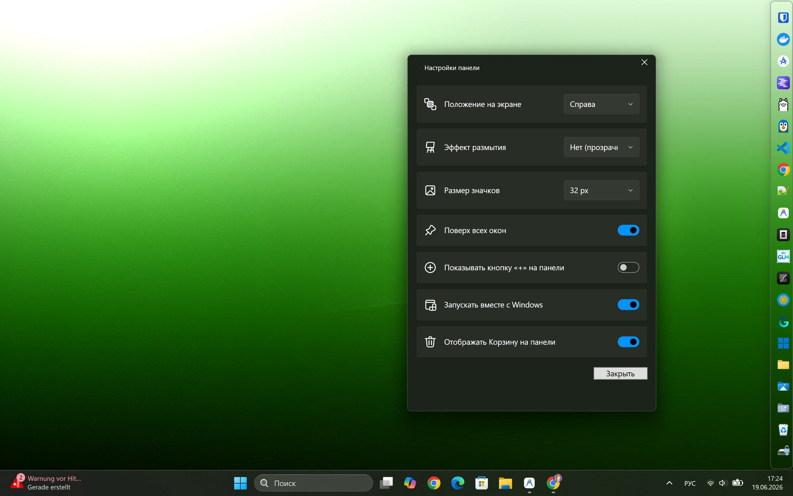
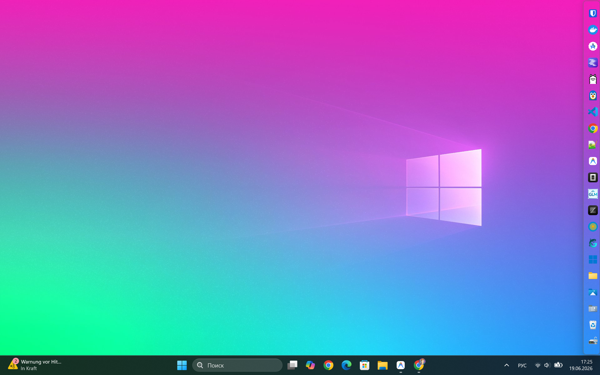
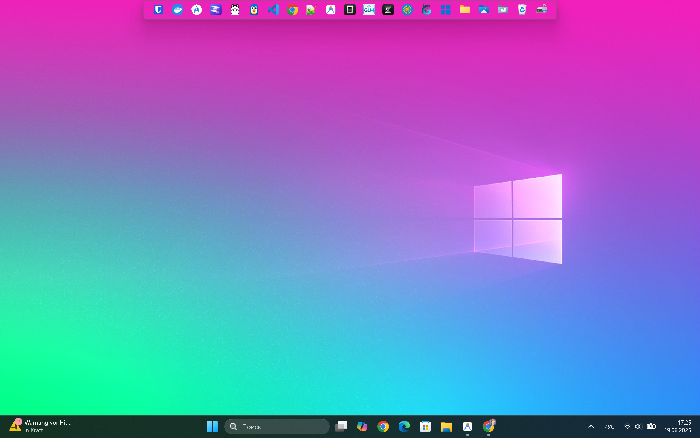
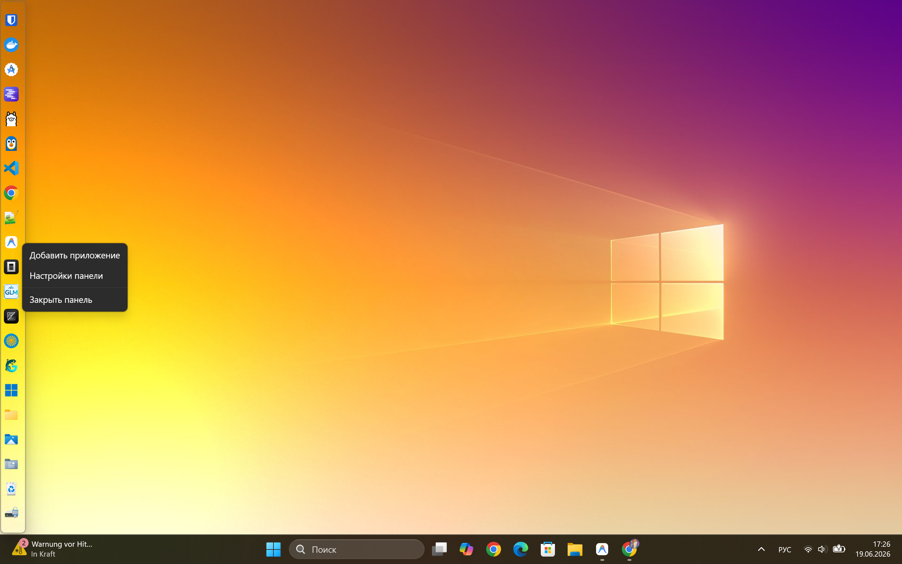
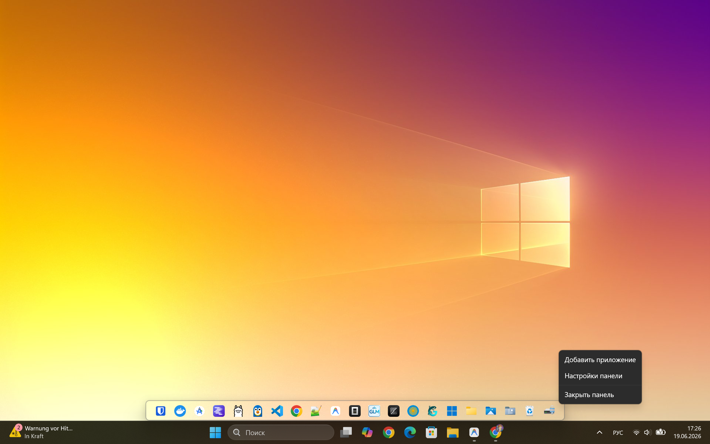

[ English ](README.md) • [ Русский ](README_RU.md) • [ Deutsch ](README_DE.md)

# ShortcutDock

**Anpassbare Fluent-Design-Schnellstartleiste für Windows 11-Desktops**

[](LICENSE)
[](#)
[](https://dotnet.microsoft.com)
[](https://twitter.com/intent/tweet?text=Schau%20dir%20ShortcutDock%20an%20--%20eine%20wundersch%C3%B6ne%2C%20anpassbare%20Schnellstartleiste%20f%C3%BCr%20Windows%2011%21&url=https%3A%2F%2Fgithub.com%2FAlmanex%2FShortcutDock&hashtags=windows11,wpf,dotnet,opensource)

---

## Übersicht

ShortcutDock ist eine moderne, leichtgewichtige Windows-Desktop-Leiste zur Organisation Ihrer Verknüpfungen. Sie bietet Mica- und Acrylic-Weichzeichnungseffekte, die sich mit dem aktiven Windows-Systemdesign synchronisieren, Drag-and-Drop-Unterstützung, automatische Ausrichtung zwischen vertikaler und horizontaler Ausrichtung, Systemplatzreservierung (AppBar) und System-Tray-Integration.

> [!IMPORTANT]
> **Erste stabile Version verfügbar!**  
> Sie können die fertige, kompilierte Datei **`ShortcutDock.exe`** auf der [Releases](https://github.com/Almanex/ShortcutDock/releases/tag/v1.0.0)-Seite herunterladen und direkt auf Ihrem Computer ausführen, ohne zusätzliche Bibliotheken installieren zu müssen.

Ausführliche Anweisungen zur Konfiguration aller Funktionen finden Sie im [Benutzerhandbuch (GUIDE.md)](GUIDE.md).

---

## Screenshots

<details open>
  <summary style="cursor: pointer; padding: 6px; font-family: sans-serif;"><b>[ Anzeigen ] 1. Horizontales Layout (Unten)</b></summary>
  <br/>
  <p align="center">
    
  </p>
</details>

<details>
  <summary style="cursor: pointer; padding: 6px; font-family: sans-serif;"><b>[ Anzeigen ] 2. Vertikales Layout (Links)</b></summary>
  <br/>
  <p align="center">
    
  </p>
</details>

<details>
  <summary style="cursor: pointer; padding: 6px; font-family: sans-serif;"><b>[ Anzeigen ] 3. Fluent Einstellungsfenster</b></summary>
  <br/>
  <p align="center">
    
  </p>
</details>

<details>
  <summary style="cursor: pointer; padding: 6px; font-family: sans-serif;"><b>[ Anzeigen ] 4. Kontextmenü und Anpassungen</b></summary>
  <br/>
  <p align="center">
    
  </p>
</details>

<details>
  <summary style="cursor: pointer; padding: 6px; font-family: sans-serif;"><b>[ Anzeigen ] 5. Horizontales Layout (Oben)</b></summary>
  <br/>
  <p align="center">
    
  </p>
</details>


---

## Hauptfunktionen

- Desktop-Leiste: Ziehen Sie `.exe`- oder `.lnk`-Dateien einfach per Drag-and-Drop direkt auf die Leiste, um sie hinzuzufügen.
- Dynamische Ausrichtung: Wechselt automatisch zwischen vertikalen (linke/rechte Bildschirmseite) und horizontalen (oben/unten) Layouts.
- Modernes Design: Unterstützung für Mica- und Acrylic-Weichzeichnungseffekte, synchronisiert mit dem aktiven Windows-Systemdesign (hell/dunkel).
- Automatisches Ausblenden: Die Leiste wird sanft ausgeblendet, wenn der Mausfokus verloren geht, um die Arbeitsfläche zu maximieren.
- Hover-Zoom & Aktivitätsindikatoren: macOS-ähnliche Icon-Vergrößerungsanimation beim Überfahren mit der Maus und farbige Punkte unter geöffneten Anwendungen.

---

## Technologiestapel

| Ebene / Komponente | Technologie | Version | Zweck |
| --- | --- | --- | --- |
| Sprache | C# (.NET 10.0) | net10.0-windows | Hauptprogrammiersprache |
| UI-Framework | WPF + WPF-UI | 4.3.0 | Moderne Steuerelemente und Mica-Fensterrahmen |
| Entwurfsmuster | MVVM Toolkit | 8.4.2 | Zustandsbindung über CommunityToolkit.Mvvm |
| Win32-Integration | P/Invoke | - | APIs für DWM, Fensterstile und AppBar |
| Grafikbibliothek | System.Drawing.Common | 10.0.9 | Icon-Extraktion und PNG-Rendering |

---

## Projektstruktur

```text
ShortcutDock/
├── ShortcutDock.slnx              # Visual Studio-Projektmappe (SDK 10-Format)
└── src\ShortcutDock\
    ├── ShortcutDock.csproj         # net10.0-windows Konfiguration
    ├── app.manifest                # DPI-Kompatibilität und Windows-Manifest
    ├── App.xaml / App.xaml.cs      # Einstiegspunkt, DI-Container und Tray-Service
    ├── MainWindow.xaml / .xaml.cs  # Hauptleiste, DWM-Blur, DnD- und AppBar-Integration
    ├── SettingsWindow.xaml / .cs   # Fluent-Design Einstellungsfenster
    ├── app_icon.ico                # Integriertes Programmsymbol
    ├── Native\
    │   └── Win32.cs                # P/Invoke-Schnittstellendefinitionen
    ├── Models\
    │   ├── Settings.cs            
    │   ├── PanelSettings.cs        # Leisteneinstellungen
    │   └── ShortcutItem.cs         # Verknüpfungsmodell (GUID, Pfad, Cache-Symbol)
    ├── Services\
    │   ├── SettingsService.cs      # settings.json in %AppData% laden/speichern
    │   ├── ProcessLauncher.cs     # Anwendungsstart, auch mit Administratorrechten
    │   ├── ShortcutResolver.cs     # Auflösen von .lnk-Verknüpfungen über COM
    │   └── IconExtractor.cs       # Extraktion großer Symbole (256x256) in PNG-Cache
    └── ViewModels\
        ├── MainViewModel.cs       # Verwaltung der Verknüpfungssammlung und Einstellungen
        └── ShortcutViewModel.cs   # Befehle zum Starten, Entfernen und für Admin-Rechte
```

---

## Daten und Konfiguration

Die Einstellungen werden als JSON unter `%AppData%\ShortcutDock\settings.json` gespeichert:

```json
{
  "PanelSettings": {
    "Position": "Bottom",
    "IconSize": 48,
    "KeepOnTop": true,
    "BackdropType": "Mica",
    "ShowAddButton": true,
    "AutoHide": false,
    "HoverZoom": true,
    "ShowRunningIndicators": true,
    "Language": "de"
  },
  "Shortcuts": [
    {
      "Id": "a1b2c3d4-...",
      "Name": "Google Chrome",
      "TargetPath": "C:\\Program Files\\Google\\Chrome\\Application\\chrome.exe",
      "IconPath": "%AppData%\\ShortcutDock\\Cache\\chrome_ABCD1234.png"
    }
  ]
}
```

Der Icon-Cache wird unter `%AppData%\ShortcutDock\Cache\*.png` abgelegt.

---

## Erste Schritte

### Voraussetzungen
- .NET 10.0 SDK oder neuer

### Bauen & Ausführen
```powershell
# Repository klonen
git clone https://github.com/Almanex/ShortcutDock.git
cd ShortcutDock

# Abhängigkeiten wiederherstellen und bauen
dotnet build

# Projekt ausführen
dotnet run --project src\ShortcutDock
```

### Standalone Veröffentlichung
So kompilieren Sie eine einzelne, eigenständige ausführbare Datei:
```powershell
dotnet publish -c Release -r win-x64 --self-contained true -p:PublishSingleFile=true
```
Die fertige ausführbare Datei wird unter `src\ShortcutDock\bin\Release\net10.0-windows\win-x64\publish\` gespeichert.

---

## Tests ausführen
Dieses Projekt verwendet manuelle UI-Tests und automatisierte Build-Checks. So überprüfen Sie die Formatierung und den Build:
```powershell
dotnet build -c Release
```

---

## Mitwirken
Bitte senden Sie Fehlerberichte (Issues) und Pull Requests auf GitHub. Bei größeren Änderungen erstellen Sie bitte zuerst ein Issue zur Diskussion.

---

## Versionsverwaltung
Wir verwenden SemVer für die Versionsverwaltung. Verfügbare Versionen und Tags finden Sie unter Releases.

---

## Autoren & Danksagungen
- Almanex - Entwickler und Erstumsetzung.
- WPF-UI Community für moderne Designelemente.

---

## Lizenz
Dieses Projekt ist unter der MIT-Lizenz lizenziert - siehe die `LICENSE`-Datei für Details.